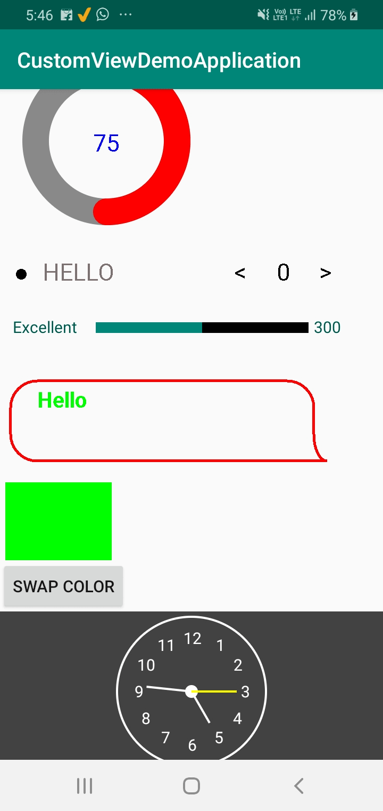

# AndroidCustomView
This repository consist of some custom views and UI components for android

# Views Implemented
* [MessageBoxView](app/src/main/java/com/example/customviewdemoapplication/Views/MessageBox.java)
* [ReviewBarView](app/src/main/java/com/example/customviewdemoapplication/Views/ReviewBarView.java)
* [RoomTypeView](app/src/main/java/com/example/customviewdemoapplication/Views/RoomTypeView.java)
* [Progress](app/src/main/java/com/example/customviewdemoapplication/Views/Progress.java)
* [MyView](app/src/main/java/com/example/customviewdemoapplication/Views/MyView.java)
* [ColorView](app/src/main/java/com/example/customviewdemoapplication/Views/ColorView.java)
* [CustomAnalogClockView](app/src/main/java/com/example/customviewdemoapplication/Views/CustomAnalogClock.java)

# Screenshot

